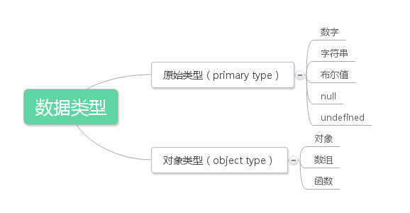
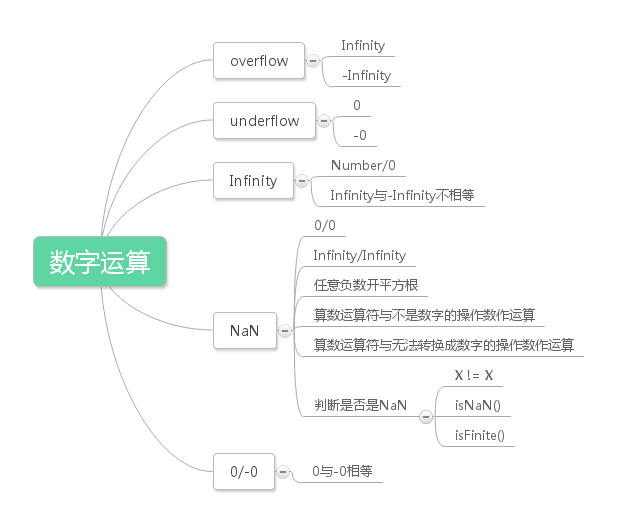
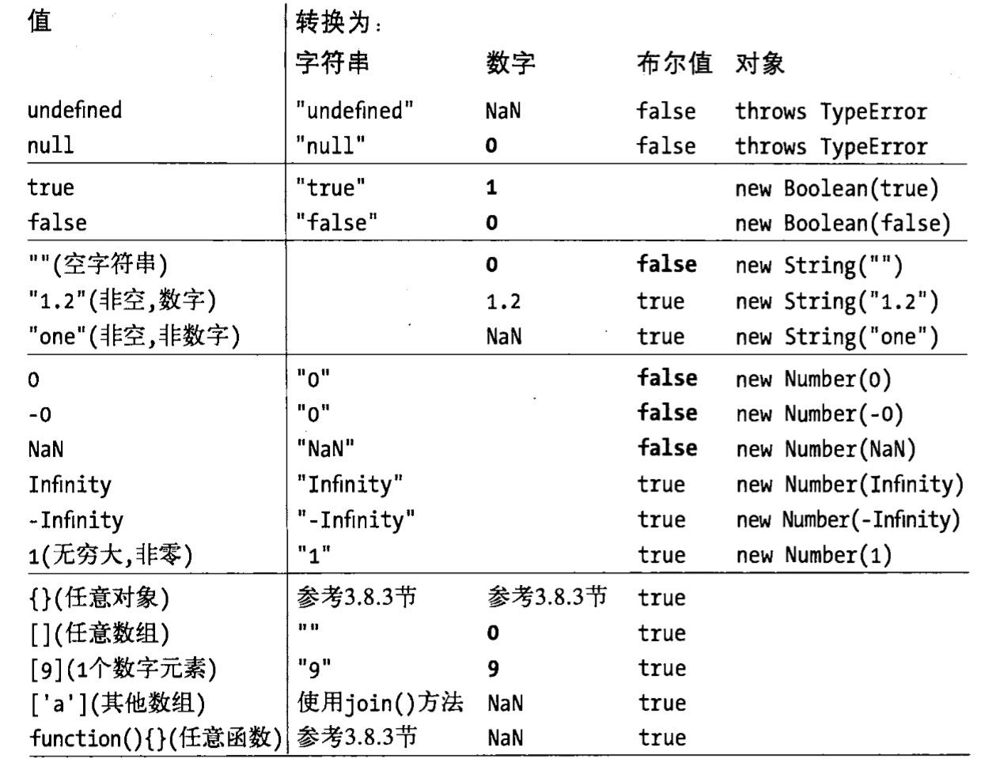
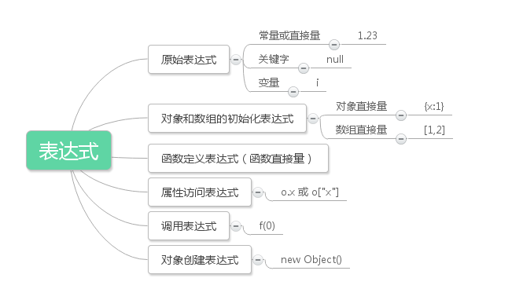

# JavaScript权威指南
## 一、词法结构
词法结构：编程语言的词法结构是一套基础性规则，用来描述如何使用这门语言来编写程序。它规定了变量名是什么样的、怎么写注释，以及程序语句之间如何分隔等规则

### 1、字符集
* JavaScript程序使用Unicode字符集编写的。
* JavaScript语言是区分大小写的语言。
* JavaScript会忽略程序中标识之间的空格。
* 注释： 使用 // 或 /**/
* 直接量：程序中直接使用的数据值。
    ```
    12 //数字直接量
    1.2 //小数
    "hello world" //字符串直接量
    true //布尔值直接量
    /javascript/gi //正则表达式直接量
    null //空
    {x:1, y:2} //对象直接量
    [1,2,3,4,5] //数组直接量
    ```
* 标识符和保留字
    * 标识符：必须以字母、下划线或美元符开始。
    
## 二、类型、值、变量

* JavaScript的数据类型


* JavaScript变量是**无类型的**

### 1、数字
* JavaScript不区分整数值和浮点数值，所有的数都用浮点数值表示。

#### - 直接量：整型直接量（十进制、十六进制）、浮点型直接量
#### - JavaScript中的算数运算
* Infinity/-Infinity：超过JavaScript所能表示的数字上限（overflow）
    * 基于它们的加、减、乘、除运算还是无穷大值。
* （underflow）：运算结果无限接近于零并比JavaScript能表示的最小值还小的时候发生的一种情形
    * 运算结果返回0
    * 负数underflow的结果是-0
* 被0整除不报错，返回：Infinity/-Infinity
* 0/0=NAN
* NAN：0/0、无穷大/无穷大、给任意负数作开方运算、算数运算符与不是数字的操作数一起使用时
* NAN与任何值都不相等，包括自身
<br/>


#### - 二进制浮点数和四舍五入错误
* 例子：
```
var x = .3 - .2;
var y = .2 - .1;
x == y //false
x == .1 //false
y == .1 //false
```

### 2、文本
* 字符串（string）是组由16位值组成的不可变的有序序列，每个字符通常来自于Unicode字符集。
* JavaScript通过字符串类型来表示文本
* 字符串长度：其所含16位值的个数。
* JavaScript中没有表示单个字符的“字符型”（！）

#### - 字符串直接量：是由单引号或双引号括起来的字符序列 
#### - 转义字符（escape sequence）
#### - 字符串的使用
* 连接（+）、求字符串长度、特殊处理（返回新的字符串）
* 字符串是只读的

### 3、布尔值
* 任意JavaScript值都可以转化为布尔值
    * false：undefined、null、0、-0、NaN、""
    * true：除了以上的所有值
* 布尔值的`toString()`方法
* &&、||、!

### 4、null和undefined
* null：用于描述“空值”，null被认为是一个特殊的对象值，含义是“非对象”
* undefined：
    * 表明变量没有初始化
    * 查询对象属性或数组元素的值时返回undefined，则说明这个属性或元素不存在
    * 如果函数没有返回任何值，则返回undefined
    * 引用没有提供实参的函数形参的值，则得到undefined
* 都不包含任何属性和方法

```
typeof( null ) //"object";
typeof( undefined ) //"undefined"
null == undefined //true
null === undefined //false
``` 

### 5.1、全局对象（global object）
* 当JavaScript解释器启动时（或者任何Web浏览器加载新页面的时候），它将创建一个新的全局对象，并给它一组定义的初始属性：
    * 全局属性：如undefined、Infinity和NaN
    * 全局函数：如isNaN()、parseInt()和eval()
    * 构造函数：如Date()、Array()、String()、Object()和RegExp()
    * 全局对象：如Math和JSON

### 5.2、包装对象
* 对象
    * JavaScript对象是一种复合值：它是属性或已命名值的集合。
    * 通过“.”符号可以引用对象的属性和方法
* 包装对象：存取字符串、数字或布尔值的属性时创建的临时对象被称为包装对象
    * 当访问字符串、数字、布尔值的属性或方法的时候，实际上是现将其转为一个临时对象，再调用其属性或方法。当调用结束后，可认为这个临时对象被销毁。
    * 通过String()、Number()、Boolean()这些构造函数可以将原始值转化为包装对象
    * null和undefined没有包装对象，访问它们的属性会造成一个类型错误
* 例子
```
var s = "test";
s.len = 4;
var t = s.len; //undefined
```
    * 解释：第二行代码创建了一个临时字符串对象，并给其len属性赋值为4，随即销毁这个对象。第三行代码通过原始的（没有被修改过）字符串创建一个新字符串对象，尝试读取其len属性，这个属性已经不存在，返回undefined。
    * 修改只发生在临时对象上，但是临时对象并未保存下来。

### 5.3、不可变的原始值和可变的对象引用
* 原始值：不可更改
    * 原始值的比较是值的比较：只有在它们的值相等时它们才相等
* 对象：可以变的
    * 对象的比较：即使两个对象包含相同的属性及相同的值，它们也是不相等的，当且仅当它们引用同一个基对象时，才相等。
    * 对象又被称为“引用类型”

### 5.4、类型转换



#### 显式类型转换
* 使用Boolean()、Number()、String()或Object()函数：
    - 当不通过new运算符调用这些函数时，它们会作为类型转换函数并按照上述图表的规则进行类型转换
    - Object(null)、Object(undefined)：返回一个空对象
* Number-to-String：
    - toString()：可选参数→转换基数（指二进制、八进制、十六进制）
    - toFixed()：指定小数点后的位数
    - toExponential()：指数计数法
    - toPrecision()：科学计数法
* String-to-Number：
    - Number()：只能基于十进制进行转换
    - parseInt()、parseFloat()：跳过前导空格，并忽略数字字符后面的内容

#### 对象转化为原始值
##### 用于转换的方法：
* 用于转换的toString()：
    - 一般对象：`obj.toString() //"[object object]"`
    - 数组对象：`[1,2,3].toString() //"1,2,3"`
    - 函数对象：返回函数体
    - RegExp类：返回正则表达式直接量的字符串
    - Date类：返回一个可读的时间字符串
* 用于转换的valueOf()：
    - 如果存在任意原始值，它就默认将对象转化为表示它的原始值。
    - 如果对象是复合值，返回对象的本身
    - 数组、函数和正则表达式调用这个方法，返回对象本身
    - 日期对象：返回1970年1月1日以来的毫秒数

##### 转换场景
* 转化为布尔值：所有对象都转化为true
    - 注意：new Boolean(false)是一个包装对象而不是原始值，将会被转化true
* 转为为字符串:
    - 如果有toString()方法，则调用这个方法。如果返回一个原始值，JavaScript将这个值转化为字符串，并返回这个字符串结果
    - 如果没有toString()方法，或者这个方法不返回一个原始值，那么调用valueOf()方法。如果存在这个方法，则调用它，如果返回值是原始值，JavaScript将这个值转化为字符串，并返回这个字符串结果。
    - 否则将抛出一个错误异常
* 转化为数字：
    - 如果具有valueOf()方法，则调用，如果返回一个原始值，JavaScript将这个原始值转化为数字并返回这个数字。
    - 如果没有valueOf()方法，有toString()方法，则调用，如果返回一个原始值，则将其转化为数字并返回。
    - 否则抛出异常

### 5.5、变量声明
* 只声明但是未给定初始值时，其值为undefined
* 重复声明是被允许
* 操作一个未声明的变量会报错

### 5.6、变量作用域
* 一个变量的作用域（scope）是程序源代码中定义这个变量的区域。

### 5.7、函数作用域和声明提前
* Js没有块级作用域（block scope），但是有函数作用域（function scope）
* 函数作用域：函数内声明的所有变量在函数体内始终是可见的。
* 声明提前：函数里声明的所有变量（但不涉及赋值）都被“提前”至函数体的顶部。
    - 声明提前这步操作是在JavaScript引擎的“预编译”时进行的，是在代码运行之前。
* 例子
```
var a = "a";
function f() {
    console.log( a );  //undefined
    var a = "b";
    console.log( a );  //b
}
```
* 声明一个全局变量时，实际上是定义了全局对象的一个属性。
* 当使用var声明一个变量时，创建的这个属性是**不可配置的**。
* 当未使用var声明一个变量时，创建了一个全局变量，这个变量是**可配置的**。
* 作用域链（scope chain）：
    - JavaScript是基于词法作用域的语言：通过阅读包含变量定义在内的数行源码就能知道变量的作用域。
    - 全局变量在程序中始终是有定义的，局部变量在声明它的函数体内以及其所嵌套的函数内始终是有定义的。

## 三、表达式（expression）和运算符
### 1、几种表达式（primary expression）
* 【原始表达式】是表达式的最小单位————它不包含其他表达式。分为：常量或直接量、关键字、变量
* 【对象创建表达式】：创建一个对象并调用一个函数（这个函数称作‘构造函数’）初始化新对象的属性。
    - 首先创建一个新对象
    - 通过传入指定的参数并将这个新的对象当做this的值来调用一个指定的函数。
    - 这个函数可以使用this来初始化这个新创建对象的属性。
    - 如果构造函数没有返回一个值，这个新创建并被初始化的对象就是整个对象创建表达式的值
    - 如果构造函数返回了一个对象值，那么这个对象就作为整个对象创建表达式的值，而新创建的对象就废弃了。


### 2、运算符


    